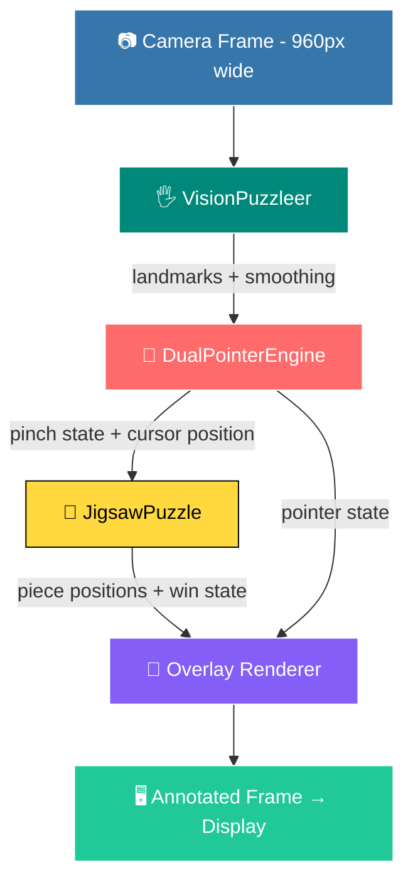

<div align="center">

# 🧩✨ 3D Vision Hand Puzzle ✨🧩

### 🖐️ *Turn your hands into the controller - no mouse, no touchscreen, just motion.* 🖐️

<br>

[](#-requirements)
[](#-requirements)
[](#-requirements)
[](#-requirements)
[](#-requirements)

[](#-license)
[](#-license)
[](#-whats-next)
[](#-why-it-exists)

<br>

⭐ **If this project sparks joy, drop it a star — it really helps!** ⭐

</div>

---

## 🗺️ Jump To

<div align="center">

| 💡 | ✨ | ⚙️ | 🚀 | 🎮 |
|:---:|:---:|:---:|:---:|:---:|
| [Why It Exists](#-why-it-exists) | [Highlights](#-highlights) | [Getting Set Up](#️-getting-set-up) | [Running It](#-running-it) | [Playing the Game](#-playing-the-game) |

| 📁 | 🧠 | 🔬 | 🛠 | 🌱 |
|:---:|:---:|:---:|:---:|:---:|
| [Anatomy of the Project](#-anatomy-of-the-project) | [How It's Wired Together](#-how-its-wired-together) | [Under the Hood](#-under-the-hood) | [When Things Go Sideways](#-when-things-go-sideways) | [What's Next](#-whats-next) |

</div>

---

## 💡 Why It Exists

> [!TIP]
> Most puzzle apps hand you a mouse and call it interactive. **Vision Hand Puzzle asks for more.**

It watches your hands, understands pinches as intent, and lets two-handed coordination drive the *entire* experience — from carving out a region of the camera feed to sliding the final piece home. 🎯

The experience unfolds in **three electric beats**:

<div align="center">

| 1️⃣ FRAME | 2️⃣ SHATTER | 3️⃣ REASSEMBLE |
|:---:|:---:|:---:|
| Frame a rectangle of your live camera view using both hands at once 🖼️ | Shatter that frame into a grid of jigsaw pieces 💥 | Reassemble the picture, one pinch-and-drag at a time 🧩 |

</div>

Underneath, MediaPipe's Hand Landmarker supplies a **21-point skeleton** per hand, and a temporal smoothing layer keeps that skeleton from trembling on screen — so the cursor you're steering feels like an extension of your fingers, not a jittery approximation of them. ✋💫

---

## ✨ Highlights

<table>
<tr>
<td width="50%" valign="top">

### 🖐️ Dual-Hand Awareness
Both hands are tracked **independently, in real time**, with exponential smoothing ironing out the natural shake of a human hand held mid-air.

### 🤌 Gesture-Native Input
No keyboard shortcuts for the core loop — a **pinch *is* a click**, and releasing *is* a drop. Two simultaneous pinches unlock two-piece manipulation. ⚡

### 🧩 Puzzle Engine
Choose between **3×3, 4×4, and 5×5** grids on the fly. Pieces snap into place automatically once they're nudged close enough to their slot.

### 🎚️ Difficulty Tiers
**Normal** mode is position-only. **Hard** mode (`D` to toggle) shuffles in a random 90° twist per piece — twist your wrist to rotate it back (or use `[` / `]`), *and* place it correctly to solve.

### 🎨 Live Visual Feedback
Skeleton overlays, gesture cursors, a selection-frame preview, and a **celebratory win animation** keep you oriented at every step. 🏆

### 📸 Post-Win Share Card
The moment you finish, a branded PNG — winning frame, solve time, grid, and rank — drops into `snapshots/`, ready to share.

</td>
<td width="50%" valign="top">

### 🎧 Ambient Audio
A looping music bed **crossfades** between Selection and Play modes, with punchy one-shot SFX for pinches, locks, snaps, shuffles, rotates, and the win moment. Press `M` to mute anytime. 🔊

### 🖼️ Custom Image Uploads
Don't want to puzzle your own face? Press `U` to pick any photo from disk — it drops into the same framing workflow as the camera, letterboxed so nothing stretches. Or skip the picker with `python main.py --image photo.jpg`. 📁

### 🎭 Theme Switcher
Press `T` to cycle **dark / light / neon / mono** palettes — the whole UI (board, HUD, cursors, particles) re-skins live, and your pick is remembered next launch.

### 🧑‍🤝‍🧑 Two-Player Co-op
Press `2` before you build the jigsaw to split the board — Left hand gets the left half's pieces, Right hand gets the right half's. Solve together, tracked on its own leaderboard.

### 🔤 Real Typography
Every label, HUD element, and banner renders with an anti-aliased custom font (Poppins, via a cached PIL-backed renderer) instead of OpenCV's blocky built-in Hershey fonts — crisp text without the frame-rate hit, since repeated text is cached as a bitmap after the first draw.

</td>
</tr>
</table>

---

## ⚙️ Getting Set Up

### 📋 What you'll need

<div align="center">

| 🧾 Requirement | 📌 Detail |
|:---|:---|
| 🐍 Python | 3.8 or newer (3.9+ tested) |
| 📷 Webcam | Any standard USB or built-in camera |
| 🖥️ CPU | Intel Core i5-class or better (a GPU helps, but isn't mandatory) |
| 💾 Memory | 4 GB minimum, 8 GB is comfortable |

</div>

### 🔗 The pipeline it runs on

```
opencv-python >= 4.9.0    →  🎥 vision + image processing
mediapipe     >= 0.10.9   →  🖐️ hand landmark inference
numpy         >= 1.26.0   →  🔢 the math holding it all together
Pygame        >= 2.5.0    →  🎨 rendering, audio, and the main loop
Pillow        >=10.0.0    →  🖼️ image loading, cropping, and saving
```

### 🪜 Installation, step by step

**1️⃣ Land in the project folder**

```bash
cd /Users/your_username/Documents/Project/3D-Untouch-Puzzle
```

**2️⃣ Spin up an isolated environment**

```bash
python3 -m venv venv

# macOS / Linux
source venv/bin/activate

# Windows
venv\Scripts\activate
```

**3️⃣ Pull in the dependencies**

```bash
python3 -m pip install -r requirements.txt
```

**4️⃣ Confirm everything took**

```bash
python3 -c "import cv2, mediapipe; print('✅ Dependencies installed successfully')"
```

---

## 🚀 Running It

```bash
python3 main.py
```

*— or, equivalently —*

```bash
python3 -m VisionPuzzle.app
```

Prefer a still photo over the webcam? Skip straight to Play with:

```bash
python3 main.py --image /Users/md.abrarhossainzahin/Desktop/3D-Untouch-Puzzle copy/VisionPuzzle/assets/image/photo.png
```

You can also pick a different camera with `--camera 1`, and switch image sources anytime in-app with the `U` key.

🎬 Once launched, your webcam feed appears on screen with hand skeletons overlaid live and a HUD tucked into the top-left corner reporting status as you move.

---

## 🎮 Playing the Game

### 🖼️ Stage One — Framing Your Selection

This is where every session begins.

1. 🙌 **Raise both hands** into view and confirm both skeletons render on screen.
2. 🤏 **Pinch with both hands at once** — thumb and index finger meeting on each side. Your two index fingertips now define the frame's opposite corners.
3. ↔️ **Drag to resize.** The preview updates live as you move; the frame can't shrink below 140×140 pixels.
4. ✅ **Release both pinches together** to lock it in — a green outline confirms the selection is set.
5. ⌨️ **Press `SPACE` or `ENTER`** to carve that region into a jigsaw grid and drop straight into Play Mode.

### 🧩 Stage Two — Solving the Puzzle

<div align="center">

| 🤏 Gesture | 🎯 What Happens |
|:---|:---|
| Pinch with one hand | Picks up the nearest piece |
| Move while pinched | Drags that piece across the board |
| Pinch with both hands | Grabs and repositions two pieces at once |
| Twist wrist while pinched | Rotates the held piece 90° per twist *(Hard mode)* |
| Release near a slot | The piece **snaps** into place |
| Release in open space | The piece scatters back into the shuffle |

</div>

> [!TIP]
> The two-handed workflow really shines once the grid gets denser — coordinating both hands lets you clear corners and edges **in parallel** instead of one piece at a time. 🚀

> [!NOTE]
> Toggle `2` in Selection mode before building the jigsaw for **Two-Player Co-op**: pieces from the left half of the image go to your Left hand, the right half to your Right hand — pick up the other player's piece and nothing happens. Progress for both is tracked separately in the HUD, and the combined finish time goes to its own leaderboard.

### ⌨️ Keyboard Shortcuts

<div align="center">

| 🔑 Key | 📍 Where | ⚡ Effect |
|:---:|:---|:---|
| `SPACE` / `ENTER` | Selection | Build the puzzle from your framed region |
| `3` `4` `5` | Play | Switch grid density |
| `D` | Selection | Toggle Normal / Hard difficulty |
| `2` | Selection | Toggle 1-player / 2-player (splits the board) |
| `U` | Selection | Upload a custom image as the puzzle source |
| `T` | Anywhere | Cycle color theme (dark → light → neon → mono) |
| `C` | Selection | Cancel the current frame |
| `R` | Play | Shuffle every piece back to random spots |
| Twist wrist | Play | Rotate the held piece (Hard mode only) |
| `[` / `]` | Play | Rotate the held piece — keyboard fallback |
| `N` | Anywhere | Return to Selection Mode for a new capture |
| `H` | Anywhere | Show or hide the help overlay |
| `M` | Anywhere | Mute or unmute audio |
| `L` | Anywhere | Show or hide the best-times leaderboard |
| `P` | Selection | Resume the last in-progress game, if one was saved |
| `Q` / `Esc` | Anywhere | Exit the app — autosaves an in-progress puzzle |

</div>

---

## 📁 Anatomy of the Project

```
3D-Untouch-Puzzle/
├── 🚪 main.py                      ← where execution begins
├── 📦 requirements.txt             ← the dependency manifest
├── 📖 README.md                    ← instructions, tips, and project overview
│
└── 🧠 VisionPuzzle/                ← the application package
    ├── 🎬 app.py                   ← VisionPuzzleApp — orchestrates the main loop
    ├── 🖐️ tracker.py               ← MediaPipe wrapper + landmark smoothing
    ├── 🤏 pointer.py               ← dual-hand pinch & gesture recognition
    ├── 📐 landmarks.py             ← landmark math and helpers
    ├── 🧩 jigsaw.py                ← puzzle grid, pieces, win logic
    ├── 🎆 effects.py               ← animations and visual transitions
    ├── 🎨 overlay.py               ← everything drawn onto the frame
    ├── 🎧 audio.py                 ← AudioManager — ambient music + SFX
    ├── 🏆 leaderboard.py           ← solve-time tracking, per board (grid × difficulty × players)
    ├── 💾 savegame.py              ← save/resume an in-progress puzzle
    ├── 📸 share.py                 ← post-win shareable PNG card
    ├── 🧰 ui.py                    ← shared UI constants, theme system, helpers
    │
    ├── 📦 models/
    │   ├── hand_landmarker.task    ← MediaPipe's hand detection model
    │   └── gesture_recognizer.task ← gesture classification model
    │
    ├── 🎵 assets/audio/
    │   ├── music/                  ← select.ogg, play.ogg (looping beds)
    │   └── sfx/                    ← pinch / lock / snap / shuffle / rotate / win
    │
    ├── 🔤 assets/fonts/
    │   └── Poppins-*.ttf            ← OFL-licensed, used for all on-screen text
    │
    ├── 📊 data/
    │   ├── leaderboard.json        ← auto-created; fastest solves per board
    │   ├── savegame.json           ← auto-created; in-progress puzzle state
    │   ├── savegame_source.png     ← auto-created; the puzzle's source crop
    │   └── settings.json           ← auto-created; remembers your last theme
    │
    └── 🗂️ snapshots/               ← auto-created; post-win share cards land here
```

---

## 🧠 How It's Wired Together

Four systems hand data to one another in sequence, **every single frame**:



- 🖐️ **`VisionPuzzleer`** turns raw camera pixels into up to two smoothed hand skeletons.
- 🤏 **`DualPointerEngine`** reads those skeletons and decides: is this a pinch? A release? Which hand?
- 🧩 **`JigsawPuzzle`** owns the actual game state — piece positions, grid layout, win detection.
- 🎨 **The overlay layer** paints everything — skeletons, cursors, the puzzle board, the HUD — back onto the frame you see.

### 🔎 The five pieces in a bit more depth

<div align="center">

| 🧩 Module | 🎯 Role |
|:---|:---|
| **VisionPuzzleer** `tracker.py` | Wraps MediaPipe's Hand Landmarker, detects up to two hands per frame, and applies EMA smoothing so the output doesn't shake with natural hand tremor. |
| **DualPointerEngine** `pointer.py` | Converts landmarks into gesture events — pinch thresholds, enter/exit state, and independent tracking per hand. |
| **JigsawPuzzle** `jigsaw.py` | Owns the grid, piece placement, snap-distance collision checks, and win-condition logic across all three grid sizes. |
| **Effects** `effects.py` | Handles transitions between states and renders the win celebration. |
| **Overlay** `overlay.py` | Draws the skeletons, selection frame, cursors, HUD, and piece highlights every single frame. |

</div>

---

## 🔬 Under the Hood

<div align="center">

| ⚙️ Aspect | 📊 Detail |
|:---|:---|
| 📐 Inference width | 960px internally, regardless of your camera's native resolution |
| 🌊 Smoothing method | Exponential Moving Average, default `alpha = 0.42` |
| 🤏 Pinch detection | Euclidean distance between thumb tip and index tip, compared against a threshold |
| 🎯 Gesture reliability | A small state machine tracks pinch enter/exit rather than trusting a single frame |
| ⚡ Performance | Frame-skipping, cached detections, and vectorized NumPy operations keep things lean; GPU acceleration is picked up automatically where MediaPipe/OpenCV support it |

</div>

---

## 🛠 When Things Go Sideways

> [!WARNING]
> Most issues below trace back to lighting, camera permissions, or a stray second instance hogging the webcam. Check those first! 💡

<details>
<summary>🖐️❌ <strong>Hands aren't being detected</strong></summary>
<br>

- 💡 Light the scene well — daylight tends to work best.
- 🖐️ Keep both hands fully inside the frame, free of sleeves, rings, or other occlusions.
- 📏 Adjust your distance and angle from the camera.
- 🔒 Double-check your OS hasn't blocked camera permissions for the app.
</details>

<details>
<summary>📳 <strong>Hand movement feels jittery</strong></summary>
<br>

- 🌊 Turn up smoothing via `LandmarkSmoother.alpha` in `tracker.py`.
- 💡 Stabilize the lighting in your space.
- 🐢 Move with slightly slower, more deliberate gestures.
- 🧹 Clear visual clutter from the background.
</details>

<details>
<summary>🧩❌ <strong>The puzzle won't generate</strong></summary>
<br>

- ✅ Confirm both hands were visible before you pinched.
- 📏 Make sure your selection frame clears the 140×140px minimum.
- 👀 Look for the "Press SPACE to create" prompt in the HUD.
- ⌨️ If the frame is already green, just press `SPACE` again.
</details>

<details>
<summary>🧲❌ <strong>Pieces refuse to snap</strong></summary>
<br>

- 🎯 Release closer to the target slot.
- 🖥️ Keep the full grid visible on screen.
- 🔀 Check that pieces aren't stacked on top of one another.
- 🔄 Hit `R` to reshuffle and try a fresh approach.
</details>

<details>
<summary>🖼️❌ <strong>"U" doesn't open a file picker</strong></summary>
<br>

- 🐍 The picker needs `tkinter`, which ships with most Python installs but not all Linux distros — try `sudo apt install python3-tk` (Debian/Ubuntu) or the equivalent for your distro.
- 🖥️ No display available (e.g. over SSH)? Skip the picker entirely and launch with `python main.py --image photo.jpg` instead.
- 📋 Check the terminal — a failed pick prints a one-line reason rather than silently doing nothing.
</details>

<details>
<summary>📷❌ <strong>The camera won't open</strong></summary>
<br>

- 🚫 Make sure no other application has claimed the webcam.
- 🔢 Try a different camera index:

  ```python
  VisionPuzzleApp(camera_index=1).run()
  ```

- 🔒 Verify camera permissions in your OS settings.
</details>

<details>
<summary>🔥 <strong>CPU or GPU usage is spiking</strong></summary>
<br>

- 📉 Lower the camera resolution if your hardware allows it.
- 📐 Reduce the inference width in `app.py`.
- 🧹 Close other background applications.
- 🕵️ Make sure you don't have a stray second instance running.
</details>

<details>
<summary>📦❌ <strong>MediaPipe can't find its model files</strong></summary>
<br>

- 📁 Confirm both files live in `VisionPuzzle/models/`.
- 🏷️ File names must match exactly:
  - `hand_landmarker.task`
  - `gesture_recognizer.task`
- 🔄 Re-download either file if it looks corrupted.
</details>

### 🩺 Diagnostics

Enable verbose output for deeper debugging:

```python
# In VisionPuzzle/app.py
self.tracker = VisionPuzzleer(model, max_hands=2, debug=True)
```

The HUD in the top-left corner reports live performance stats:

```
FPS: 30.5
Hands: 2
Latency: 12ms
```

---

## 🌱 What's Next

<div align="center">

| 🖼️ | 🎵 | 🏆 |
|:---:|:---:|:---:|
| Face-blur privacy mode | Pinch calibration | Player profiles |

| 🔄 | 🎭 | 💾 |
|:---:|:---:|:---:|
| Timed challenge mode | Hint system | Real jigsaw-shaped pieces |

</div>

> [!NOTE]
> Got an idea that's not on this list? Contributions and feature suggestions are always welcome! 🙌

---

<div align="center">

### 🧩 *Frame it. Shatter it. Put it back together — with your hands.* 🖐️✨

<br>

**⭐ Star this repo if Vision Hand Puzzle made you smile ⭐**

</div>
