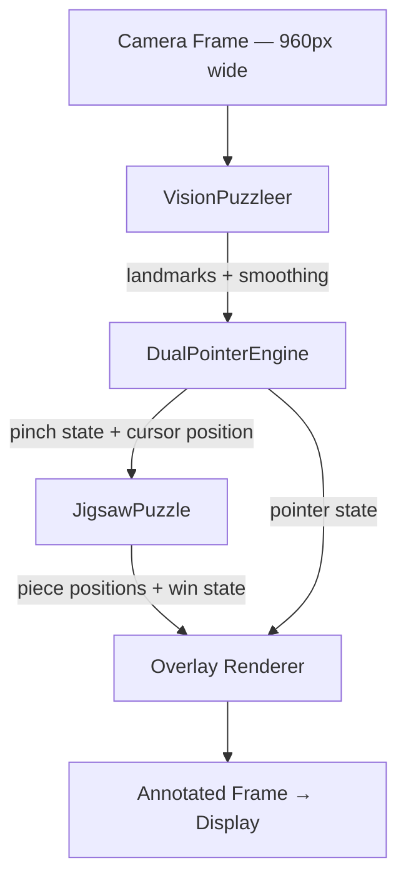

<div align="center">

# 🧩 VisionPuzzle Studio

### *Turn your hands into the controller — no mouse, no touchscreen, just motion.*

An interactive, real-time hand gesture recognition application that transforms dual-hand movements into intuitive controls for creating and playing jigsaw puzzles. Powered by MediaPipe for precise hand tracking and OpenCV for computer vision, the system offers a natural, touchless user experience.

[](#requirements)
[](#requirements)
[](#requirements)
[](#license)

</div>

---

## 🗺️ Contents

| | | | | |
|---|---|---|---|---|
| [Why It Exists](#-why-it-exists) | [Highlights](#-highlights) | [Getting Set Up](#️-getting-set-up) | [Running It](#-running-it) | [When Things Go Sideways](#-when-things-go-sideways) |
| [Playing the Game](#-playing-the-game) | [Anatomy of the Project](#-anatomy-of-the-project) | [How It's Wired Together](#-how-its-wired-together) | [Under the Hood](#-under-the-hood) | [What's Next](#-whats-next) |

---

## 💡 Why It Exists

Most puzzle apps hand you a mouse and call it interactive. VisionPuzzle Studio asks for more: it watches your hands, understands pinches as intent, and lets two-handed coordination drive the entire experience — from carving out a region of the camera feed to sliding the final piece home.

The experience unfolds in three beats:

1. **Frame** a rectangle of your live camera view using both hands at once.
2. **Shatter** that frame into a grid of jigsaw pieces.
3. **Reassemble** the picture, one pinch-and-drag at a time.

Underneath, MediaPipe's Hand Landmarker supplies a 21-point skeleton per hand, and a temporal smoothing layer keeps that skeleton from trembling on screen — so the cursor you're steering feels like an extension of your fingers, not a jittery approximation of them.

---

## ✨ Highlights

<table>
<tr>
<td width="50%" valign="top">

**🖐️ Dual-Hand Awareness**
Both hands are tracked independently, in real time, with exponential smoothing ironing out the natural shake of a human hand held mid-air.

**🤌 Gesture-Native Input**
No keyboard shortcuts for the core loop — a pinch *is* a click, and releasing *is* a drop. Two simultaneous pinches unlock two-piece manipulation.

</td>
<td width="50%" valign="top">

**🧩 Puzzle Engine**
Choose between 3×3, 4×4, and 5×5 grids on the fly. Pieces snap into place automatically once they're nudged close enough to their slot.

**🎨 Live Visual Feedback**
Skeleton overlays, gesture cursors, a selection-frame preview, and a celebratory win animation keep you oriented at every step.

</td>
</tr>
</table>

---

## ⚙️ Getting Set Up

### What you'll need

| Requirement | Detail |
|---|---|
| Python | 3.8 or newer (3.9+ tested) |
| Webcam | Any standard USB or built-in camera |
| CPU | Intel Core i5-class or better (a GPU helps, but isn't mandatory) |
| Memory | 4 GB minimum, 8 GB is comfortable |

### The pipeline it runs on

```
opencv-python >= 4.9.0    →  vision + image processing
mediapipe     >= 0.10.9   →  hand landmark inference
numpy         >= 1.26.0   →  the math holding it all together
```

### Installation, step by step

**1. Land in the project folder**

```bash
cd /Users/your_username/Documents/Project/3D-Untouch-Puzzle
```

**2. Spin up an isolated environment**

```bash
python3 -m venv venv

# macOS / Linux
source venv/bin/activate

# Windows
venv\Scripts\activate
```

**3. Pull in the dependencies**

```bash
python3 -m pip install -r requirements.txt
```

**4. Confirm everything took**

```bash
python3 -c "import cv2, mediapipe; print('✓ Dependencies installed successfully')"
```

---

## 🚀 Running It

```bash
python3 main.py
```

*— or, equivalently —*

```bash
python3 -m VisionPuzzle.app
```

Once launched, your webcam feed appears on screen with hand skeletons overlaid live and a HUD tucked into the top-left corner reporting status as you move.

---

## 🎮 Playing the Game

### Stage One — Framing Your Selection

This is where every session begins.

1. **Raise both hands** into view and confirm both skeletons render on screen.
2. **Pinch with both hands at once** — thumb and index finger meeting on each side. Your two index fingertips now define the frame's opposite corners.
3. **Drag to resize.** The preview updates live as you move; the frame can't shrink below 140×140 pixels.
4. **Release both pinches together** to lock it in — a green outline confirms the selection is set.
5. **Press `SPACE` or `ENTER`** to carve that region into a jigsaw grid and drop straight into Play Mode.

### Stage Two — Solving the Puzzle

| Gesture | What Happens |
|---|---|
| Pinch with one hand | Picks up the nearest piece |
| Move while pinched | Drags that piece across the board |
| Pinch with both hands | Grabs and repositions two pieces at once |
| Release near a slot | The piece snaps into place |
| Release in open space | The piece scatters back into the shuffle |

> **Tip:** the two-handed workflow really shines once the grid gets denser — coordinating both hands lets you clear corners and edges in parallel instead of one piece at a time.

### Keyboard Shortcuts

| Key | Where | Effect |
|---|---|---|
| `SPACE` / `ENTER` | Selection | Build the puzzle from your framed region |
| `3` `4` `5` | Play | Switch grid density |
| `C` | Selection | Cancel the current frame |
| `R` | Play | Shuffle every piece back to random spots |
| `N` | Anywhere | Return to Selection Mode for a new capture |
| `H` | Anywhere | Show or hide the help overlay |
| `Q` / `Esc` | Anywhere | Exit the app |

---

## 📁 Anatomy of the Project

```
3D-Untouch-Puzzle/
├── main.py                         ← where execution begins
├── requirements.txt                ← the dependency manifest
├── README.md                       ← instructions, tips, and project overview
│
└── VisionPuzzle/                   ← the application package
    ├── app.py                      ← VisionPuzzleApp — orchestrates the main loop
    ├── tracker.py                  ← MediaPipe wrapper + landmark smoothing
    ├── pointer.py                  ← dual-hand pinch & gesture recognition
    ├── landmarks.py                ← landmark math and helpers
    ├── jigsaw.py                   ← puzzle grid, pieces, win logic
    ├── effects.py                  ← animations and visual transitions
    ├── overlay.py                  ← everything drawn onto the frame
    ├── ui.py                       ← shared UI constants and helpers
    │
    ├── models/
    │   ├── hand_landmarker.task    ← MediaPipe's hand detection model
    │   └── gesture_recognizer.task ← gesture classification model
    │
    └── snapshots/                  ← cached puzzle captures
```

---

## 🧠 How It's Wired Together

Four systems hand data to one another in sequence, each frame:



- **`VisionPuzzleer`** turns raw camera pixels into up to two smoothed hand skeletons.
- **`DualPointerEngine`** reads those skeletons and decides: is this a pinch? A release? Which hand?
- **`JigsawPuzzle`** owns the actual game state — piece positions, grid layout, win detection.
- **The overlay layer** paints everything — skeletons, cursors, the puzzle board, the HUD — back onto the frame you see.

### The five pieces in a bit more depth

| Module | Role |
|---|---|
| **VisionPuzzleer** (`tracker.py`) | Wraps MediaPipe's Hand Landmarker, detects up to two hands per frame, and applies EMA smoothing so the output doesn't shake with natural hand tremor. |
| **DualPointerEngine** (`pointer.py`) | Converts landmarks into gesture events — pinch thresholds, enter/exit state, and independent tracking per hand. |
| **JigsawPuzzle** (`jigsaw.py`) | Owns the grid, piece placement, snap-distance collision checks, and win-condition logic across all three grid sizes. |
| **Effects** (`effects.py`) | Handles transitions between states and renders the win celebration. |
| **Overlay** (`overlay.py`) | Draws the skeletons, selection frame, cursors, HUD, and piece highlights every single frame. |

---

## 🔬 Under the Hood

| Aspect | Detail |
|---|---|
| Inference width | 960px internally, regardless of your camera's native resolution |
| Smoothing method | Exponential Moving Average, default `alpha = 0.42` |
| Pinch detection | Euclidean distance between thumb tip and index tip, compared against a threshold |
| Gesture reliability | A small state machine tracks pinch enter/exit rather than trusting a single frame |
| Performance | Frame-skipping, cached detections, and vectorized NumPy operations keep things lean; GPU acceleration is picked up automatically where MediaPipe/OpenCV support it |

---

## 🛠 When Things Go Sideways

<details>
<summary><strong>Hands aren't being detected</strong></summary>

- Light the scene well — daylight tends to work best.
- Keep both hands fully inside the frame, free of sleeves, rings, or other occlusions.
- Adjust your distance and angle from the camera.
- Double-check your OS hasn't blocked camera permissions for the app.
</details>

<details>
<summary><strong>Hand movement feels jittery</strong></summary>

- Turn up smoothing via `LandmarkSmoother.alpha` in `tracker.py`.
- Stabilize the lighting in your space.
- Move with slightly slower, more deliberate gestures.
- Clear visual clutter from the background.
</details>

<details>
<summary><strong>The puzzle won't generate</strong></summary>

- Confirm both hands were visible before you pinched.
- Make sure your selection frame clears the 140×140px minimum.
- Look for the "Press SPACE to create" prompt in the HUD.
- If the frame is already green, just press `SPACE` again.
</details>

<details>
<summary><strong>Pieces refuse to snap</strong></summary>

- Release closer to the target slot.
- Keep the full grid visible on screen.
- Check that pieces aren't stacked on top of one another.
- Hit `R` to reshuffle and try a fresh approach.
</details>

<details>
<summary><strong>The camera won't open</strong></summary>

- Make sure no other application has claimed the webcam.
- Try a different camera index:

  ```python
  VisionPuzzleApp(camera_index=1).run()
  ```

- Verify camera permissions in your OS settings.
</details>

<details>
<summary><strong>CPU or GPU usage is spiking</strong></summary>

- Lower the camera resolution if your hardware allows it.
- Reduce the inference width in `app.py`.
- Close other background applications.
- Make sure you don't have a stray second instance running.
</details>

<details>
<summary><strong>MediaPipe can't find its model files</strong></summary>

- Confirm both files live in `VisionPuzzle/models/`.
- File names must match exactly:
  - `hand_landmarker.task`
  - `gesture_recognizer.task`
- Re-download either file if it looks corrupted.
</details>

### Diagnostics

Enable verbose output for deeper debugging:

```python
# In VisionPuzzle/app.py
self.tracker = VisionPuzzleer(model, max_hands=2, debug=True)
```

The HUD in the top-left corner reports live performance stats:

```
FPS: 30.5
Hands: 2
Latency: 12ms
```

---

## 🌱 What's Next

A few directions this project could grow into:

- 🖼️ Custom image uploads as puzzle sources
- 🎵 Ambient sound effects and background scoring
- 🏆 A leaderboard with solve-time tracking
- 🔄 Difficulty tiers that add piece rotation
- 🎭 Multiple visual themes for the puzzle board
- 💾 Save-and-resume support for in-progress games
- 🌐 Networked, multiplayer hand-tracking sessions
- 📈 Built-in performance analytics

---

<div align="center">

*Frame it. Shatter it. Put it back together — with your hands.* 🧩

</div>